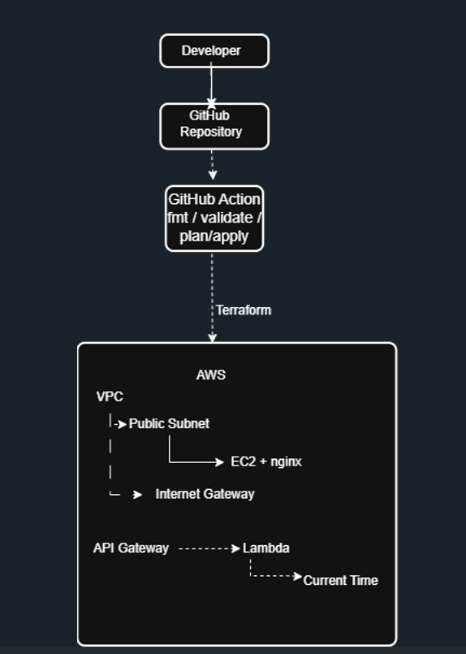

# AWS Infrastructure Deployment

## Overview

This project demonstrates the design and deployment of a small AWS-based
service using Terraform Infrastructure as Code.

The solution provisions an AWS network and compute service, together with
a separate serverless component exposed through API Gateway.

The implementation focuses on:

- Infrastructure as Code using Terraform
- Modular Terraform configuration
- AWS networking and compute
- Serverless architecture using AWS Lambda
- API Gateway integration
- IAM and least-privilege principles
- Basic CI validation using GitHub Actions
- Security, scalability and reliability considerations

---

## Architecture



### Architecture flow

The solution consists of two main service paths:

**Web application**

Internet → Internet Gateway → Public Subnet → EC2 → Nginx

**Serverless API**

Internet → API Gateway → Lambda → Current UTC Time

The infrastructure is deployed into an AWS VPC using Terraform.

---

## AWS Components

### Networking

- VPC: `10.0.0.0/16`
- Public subnet: `10.0.1.0/24`
- Internet Gateway
- Public route table
- Route table association

### Compute

An Amazon Linux EC2 instance is deployed as the compute service.

The instance uses Terraform user data to:

1. Update the operating system
2. Install Nginx
3. Enable and start the Nginx service
4. Create a simple HTML response

The EC2 instance is exposed through HTTP port 80.

### Serverless

A separate AWS Lambda function provides the current UTC time.

The Lambda function is invoked through an Amazon API Gateway HTTP API.

The Lambda execution role is restricted to the permissions required for
basic Lambda execution and CloudWatch logging.

---

## Terraform Structure

```text
.
├── .github/
│   └── workflows/
│       └── terraform.yml
│
├── lambda/
│   └── lambda_function.py
│
├── modules/
│   ├── network/
│   │   ├── main.tf
│   │   ├── variables.tf
│   │   └── outputs.tf
│   │
│   ├── ec2/
│   │   ├── main.tf
│   │   ├── variables.tf
│   │   └── outputs.tf
│   │
│   ├── lambda/
│   │   ├── main.tf
│   │   ├── variables.tf
│   │   └── outputs.tf
│   │
│   └── api_gateway/
│       ├── main.tf
│       ├── variables.tf
│       └── outputs.tf
│
├── main.tf
├── provider.tf
├── variables.tf
├── outputs.tf
├── versions.tf
└── README.md